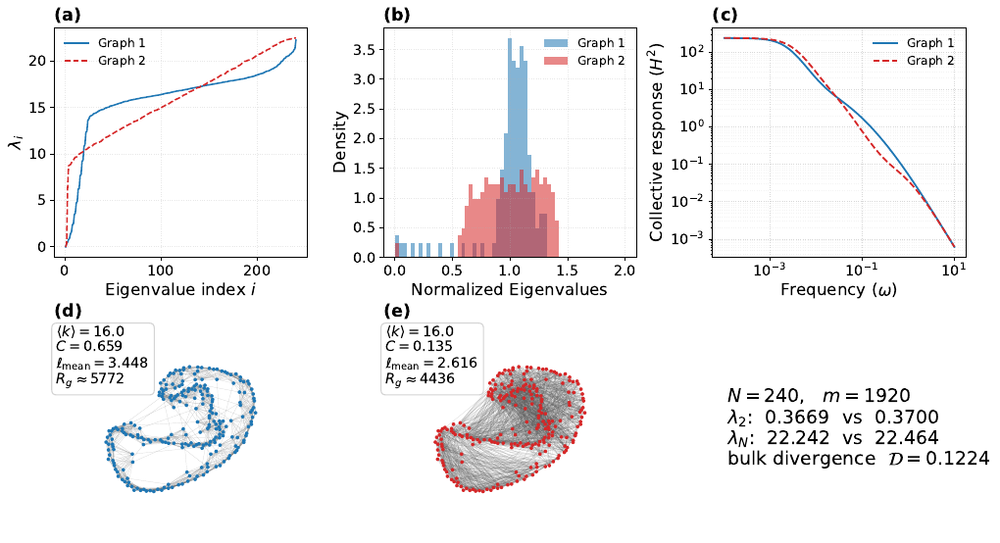

# Spectral-characterization-of-collective-response

Data availability and reproducibility for

```text
"Spectral characterization of collective response in consensus dynamics beyond the extreme Laplacian eigenvalues"
```

<p align="center">
  
</p>

<p align="center">Figure 1: a WS graph pair matched on λ₂, λ_N and edge count, with divergent intermediate spectra (<a href="figures/Figure_1.pdf">PDF</a>).</p>

## Environment

See [requirements.txt](requirements.txt) for the exact package versions used.
On a local machine, `graph-tool` is easiest to get via conda-forge (it is not
pip-installable); the rest can come from conda or pip.

```bash
conda create -n spectral-collective-response -c conda-forge python=3.10 graph-tool=2.56 \
    numpy=1.25.2 pandas=2.1.0 scipy=1.11.2 networkx=3.1 matplotlib=3.7.2
conda activate spectral-collective-response
pip install ipykernel nbconvert   # only needed to execute the notebooks
```

On the HPC cluster the data was produced on, the same packages come from
environment modules: `module load StdEnv/2020 gcc/9.3.0 graph-tool/2.56 python/3.10`.
Figures 3 and S3–S5 render their text with LaTeX, so a TeX installation must be on `PATH`.

## Pipeline

`nets/` holds the data. It is either **unpacked** from the archives in `data/`
(below) or **regenerated** by the pipeline in `scripts/`; see
[scripts/README.md](scripts/README.md) for the stage-by-stage breakdown and run
order. There are two datasets:

- **Spectral divergence** (`scripts/spec_div/`, Figs. 1, 2, S1, S2): 14,000 graph
  pairs per family (Watts–Strogatz and Holme–Kim, N = 240, ⟨k⟩ = 16) matched on
  λ₂, λ_N and edge count but made as different as possible in the rest of the
  Laplacian spectrum, with the leader–follower collective response H² of each graph.
- **Consensus models on WS/MHK ensembles** (`scripts/LFC/`, Figs. 3, S3–S5): the
  LFC, lazy random-walk, Metropolis–Hastings and bounded-confidence collective
  responses over the rewiring sweep, with the spectral and structural statistics
  of every network.

## Data

`data/` ships the figure-level data as eight `tar.gz` archives split into
`<=10MB` chunks: every table the figures read, plus the graph files that a
figure opens directly or that carry the expensive bounded-confidence simulation
results. See [data/README.md](data/README.md) for the archive list.

**Not shipped:** about 25 GB of further graph files. These are the 22,700 LFC
ensemble graphs not listed above and the 55,996 graphs of the spectral-divergence
pairs other than Fig. 1's. No figure needs them, since every quantity the figures use
is in the shipped CSVs. The LFC graphs and the spectral-divergence reference graphs
can be rebuilt edge for edge from their recorded seeds; the annealed partner graphs
only statistically. [data/README.md](data/README.md#not-shipped-regenerable) lists
them, and the steps are in
[scripts/LFC/README.md](scripts/LFC/README.md#regenerating-the-unshipped-graphs) and
[scripts/spec_div/README.md](scripts/spec_div/README.md#regenerating-the-unshipped-pair-graphs).

To unpack, run `reassemble.sh` from this directory:

```bash
bash reassemble.sh LFC_240_ws_gt   # one archive
bash reassemble.sh all             # every archive
```

It concatenates the parts, verifies the result against
`data/checksums_full.sha256`, and extracts it into `nets/`, the layout every
script reads from.

## Figures

`figures/` holds the paper's figures (one PDF per figure; the two-family
Figures 2, S1 and S2 are one PDF per family). With `nets/` populated, they are
regenerated into `output/` by two SLURM jobs, submitted from this directory:

```bash
mkdir -p logs
sbatch scripts/spec_div/run_paper_figs.sh   # Figs. 2, S1, S2
sbatch scripts/figures/run_figures.sh       # Figs. 1, 3, S3, S4, S5
```

| Figure | File | Produced by |
|---|---|---|
| 1 | `Figure_1.pdf` | `scripts/spec_div/plot_top_pair.py --family ws` |
| 2 | `Figure_2_ws.pdf`, `Figure_2_mhk.pdf` | `scripts/spec_div/analyzer_corr_gen.ipynb` |
| 3 | `Figure_3.pdf` | `scripts/figures/Figures_CRgSK.ipynb` (WS, ε = 0.2) |
| S1 | `Figure_S1_ws.pdf`, `Figure_S1_mhk.pdf` | `scripts/spec_div/analyzer_corr_gen_norm.ipynb` |
| S2 | `Figure_S2_ws.pdf`, `Figure_S2_mhk.pdf` | `scripts/spec_div/analyzer_corr_gen.ipynb` |
| S3 | `Figure_S3.pdf` | `scripts/figures/Figures_CRgSK.ipynb` (MHK, ε = 0.2) |
| S4 | `Figure_S4.pdf` | `scripts/figures/gen_bc_supplement.py` (WS, ε = 0.05, 0.3) |
| S5 | `Figure_S5.pdf` | `scripts/figures/gen_bc_supplement.py` (MHK, ε = 0.05, 0.3) |

## Folder structure

```
.
├── README.md                     # this file
├── LICENSE                       # CC BY 4.0
├── requirements.txt              # Python packages used (see "Environment")
├── reassemble.sh                 # data/*.tar.gz.part* -> nets/
├── package_data.sh               # nets/ -> data/*.tar.gz.part* (the reverse)
├── submit_package_data.sh        # SLURM wrapper for package_data.sh
│
├── scripts/                      # generation + figure pipeline (see scripts/README.md)
│   ├── spec_div/                 # matched-pair generation, gains, CSVs, Figs. 1, 2, S1, S2
│   ├── LFC/                      # WS/MHK ensembles, consensus gains, bounded-confidence sweep
│   └── figures/                  # Figs. 3, S3, S4, S5 (+ run_figures.sh)
│
├── nets/                         # data - unpacked or generated here (see nets/README.md)
│   ├── spec_div/                 # pair CSVs, pairs_index.csv per seed, Fig. 1 graphs
│   └── LFC/240/{ws,mhk}/         # per-seed props/gains CSVs, k=16 graphs
│
├── figures/                      # paper figures (Figure_1.pdf ... Figure_S5.pdf)
│
├── data/                         # chunked <=10MB archives of nets/
│   ├── README.md                 # archive list, contents, how to reassemble
│   ├── checksums_full.sha256     # sha256 of each whole (reassembled) archive
│   ├── checksums_parts.sha256    # sha256 of each individual chunk
│   └── <archive>.tar.gz.part###
│
└── logs/                         # SLURM job logs (populated at submission time)
```

## License

This work is licensed under a
[Creative Commons Attribution 4.0 International License (CC BY 4.0)](https://creativecommons.org/licenses/by/4.0/);
see [LICENSE](LICENSE). You are free to share and adapt this data and code for any
purpose, including commercially, as long as you give appropriate credit.
